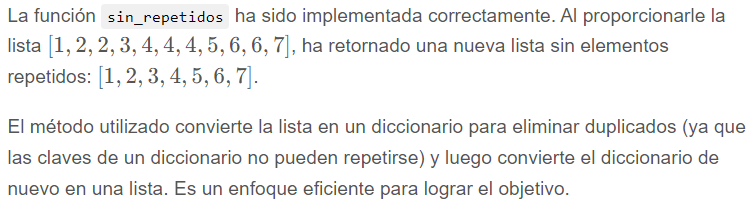
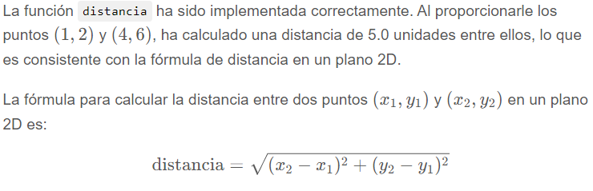

<div align='center'>

# Practica 0 Introducción a Python

</div>

# Jupyter Notebooks y Google Colab
### Ejercicio 1
**Respuestas:**
- **¿Qué es un cuaderno (notebook) Jupyter?**
  - Un cuaderno Jupyter es una herramienta de código abierto que permite crear y compartir documentos interactivos que contienen código, ecuaciones, visualizaciones y texto narrativo. Estos cuadernos se utilizan ampliamente en análisis de datos, enseñanza, ciencia de datos, entre otros. Los cuadernos Jupyter son ideales para crear un ambiente donde se pueden combinar la ejecución de código y la documentación en un solo lugar.
- **¿Qué es una celda?**
  - Una celda es la unidad básica de contenido en un cuaderno Jupyter. Es un espacio donde se puede escribir código para ser ejecutado o se puede introducir texto para explicación y documentación.
- **¿Qué tipos de celdas existen?**
  - Existen tres tipos principales de celdas en un cuaderno Jupyter:
    1. **Celda de código:** Contiene código que puede ser ejecutado. Al correr esta celda, los resultados se muestran debajo de ella.
    2. **Celda de texto/Markdown:** Esta celda contiene texto formateado utilizando el lenguaje Markdown. Permite incluir explicaciones, imágenes, enlaces y más.
    3. **Celda Raw:** Es una celda que no se renderiza. Se utiliza para introducir contenido que no se desea ejecutar o transformar.
- **¿Qué es un entorno de ejecución?**
  - Un entorno de ejecución se refiere al contexto o espacio donde se ejecuta un código o programa. Proporciona todas las herramientas, bibliotecas, variables y recursos necesarios para que el código funcione correctamente. En el ámbito de Jupyter, el entorno de ejecución es gestionado por un "kernel", que es el encargado de interpretar y ejecutar el código escrito en las celdas.
- **¿Cuánto tiempo dura una sesión de un entorno?**
  - La duración de una sesión de entorno de ejecución varía según dónde se esté ejecutando el cuaderno:
    - **Localmente:** En un Jupyter Notebook ejecutado en una máquina local, el entorno de ejecución (o kernel) continúa funcionando hasta que el usuario lo detiene o cierra el cuaderno.
    - **En plataformas en la nube:** En plataformas como Google Colab, la duración de una sesión puede ser limitada. Por ejemplo, las sesiones gratuitas en Google Colab suelen tener una duración máxima de 12 horas. Es recomendable revisar la documentación específica de la plataforma que se esté utilizando para detalles precisos.


### Ejercicio 2

Las celdas de código de un cuaderno no solo permiten ejecutar instrucciones de Python. Utilizando el símbolo ! (signo de admiración) es posible ejecutar los comandos disponibles desde la línea de comandos de su sistema operativo. De esta manera `!ls` o `!dir` (dependiendo el sistema operativo) listan los archivos de la carpeta actual y `!pip` o `!conda` permiten administrar los paquetes python.

Experimente la ejecución de varios comandos del sistema operativo a través de celdas de código. Entre las
pruebas incluya la invocación de:
- python para determinar la versión instalada.
- pip show nombre (pandas, numpy, tensorflow, etc.) de paquete para saber la versión instalada.
- comandos que permitan crear y eliminar carpetas.


El ejercicio que has mencionado se refiere a la ejecución de comandos del sistema operativo directamente desde un cuaderno Jupyter (o IPython). A continuación, te mostraré cómo hacerlo:

1. **Ejecutar comandos del sistema operativo**: 
   En un cuaderno Jupyter, puedes ejecutar comandos del sistema operativo precediendo el comando con un signo de exclamación `!`.

   Ejemplo:
   - Para listar los archivos en la carpeta actual (en sistemas Unix-like):
     ```python
     !ls
     ```
   - Para sistemas Windows:
     ```python
     !dir
     ```

2. **Determinar la versión de Python**:
   ```python
   !python --version
   ```

3. **Ver la versión de un paquete específico con pip**:
   - Para `pandas`:
     ```python
     !pip show pandas
     ```
   - Para `numpy`:
     ```python
     !pip show numpy
     ```
   - Y así sucesivamente para otros paquetes.

4. **Crear y eliminar carpetas**:
   - Crear una carpeta llamada "test_folder":
     ```python
     !mkdir test_folder
     ```
   - Eliminar la carpeta "test_folder":
     ```python
     !rmdir test_folder
     ```

Estos comandos se pueden ejecutar directamente en las celdas de un cuaderno Jupyter. Sin embargo, ten en cuenta que la capacidad de ejecutar comandos del sistema operativo desde un cuaderno puede variar según la configuración de seguridad y el entorno en el que se esté ejecutando el cuaderno.


### Ejercicio 3
Dado que el entorno de ejecución de un cuaderno Colab tiene un límite de duración, es importante descargar o salvar fuera del mismo los archivos que se generan.

Conecte su cuenta de Google Drive con Google Colab:

- Acceda a la url https://colab.research.google.com/ y autentíquese con su usuario Google. Cree un nuevo cuaderno (notebook).
- Asocie Drive con Colab. Compruebe que Drive queda montado como una carpeta.
- Suba un pequeño archivo de texto a Drive (NO a Colab) y ábralo desde una celda de código Colab utilizando el siguiente código:
  ```python
  ruta_arch = '....' # ruta y nombre a archivo a LEER desde su drive
  f = open(ruta_arch, 'r') # abre archivo para leer
  print(f.readlines()) # imprime contenido en pantalla
  f.close() # cierra archivo
  ```
- Genere el siguiente archivo y guárdelo en su carpeta Drive, comprobando que efectivamente se ha creado con el contenido esperado:
  ```python
  ruta_arch = '....' # ruta y nombre a archivo a ESCRIBIR en su drive
  f = open(ruta_arch, 'w') # abre archivo para escribir
  texto = 'Esta es una linea de texto\nEsta es otra línea de text'
  f.writelines(texto) # escribe contenido en archivo
  f.close() # cierra archivo
  ```


# Repaso de Python

### Ejercicio 1
Investigue/repase que son las listas, tuplas, conjuntos y diccionarios nativos de Python (puede consultar https://www.youtube.com/watch?v=CCUNuqqn7PQ) . Utilizando los constructores para cada tipo de dato genere códigos de ejemplo y recórralos imprimiendo sus valores.

1. **Listas**:
   - Son colecciones ordenadas y mutables.
   - Pueden contener cualquier tipo de dato: números, cadenas, otras listas, etc.
   - Se definen usando corchetes `[]`.

   Ejemplo:
   ```python
   lista = [1, 2, 3, 4, 5]
   for elemento in lista:
       print(elemento)
   ```

2. **Tuplas**:
   - Son colecciones ordenadas e inmutables.
   - Se definen usando paréntesis `()`.

   Ejemplo:
   ```python
   tupla = (1, 2, 3, 4, 5)
   for elemento in tupla:
       print(elemento)
   ```

3. **Conjuntos (sets)**:
   - Son colecciones no ordenadas y no tienen elementos duplicados.
   - Se definen usando llaves `{}` o con el constructor `set()`.

   Ejemplo:
   ```python
   conjunto = {1, 2, 3, 4, 5}
   for elemento in conjunto:
       print(elemento)
   ```

4. **Diccionarios**:
   - Son colecciones no ordenadas de pares clave-valor.
   - Las claves son únicas y pueden ser de cualquier tipo inmutable.
   - Se definen usando llaves `{}` con pares clave-valor separados por `:`.

   Ejemplo:
   ```python
   diccionario = {"a": 1, "b": 2, "c": 3}
   for clave, valor in diccionario.items():
       print(f"Clave: {clave}, Valor: {valor}")
   ```

Puedes ejecutar estos ejemplos en tu entorno Python para ver cómo funcionan. ¡Espero que esto te ayude a comprender mejor estos tipos de datos en Python!


### Ejercicio 2
Genere el código necesario para recorrer simultáneamente 2 listas con la misma cantidad de elementos e imprima los mismos utilizando un único for (tip: función zip).

<table >
    <thead>
        <tr>
            <th>Código</th>
            <th>Salida</th>
        </tr>
    </thead>
    <tbody>
        <tr>
            <td>

```python
lista1 = [1, 2, 3, 4, 5]
lista2 = ['a', 'b', 'c', 'd', 'e']

for elemento1, elemento2 in zip(lista1, lista2):
    print(elemento1, elemento2)
```

</td>
<td>
  1 a<br>
  2 b<br>
  3 c<br>
  4 d<br>
  5 e
</td>
</tr>
</tbody>
</table>


### Ejercicio 3
Implemente una función que a partir de la lista que recibe cómo parámetro, retorne una nueva lista sin elementos repetidos. Compruebe su correcto funcionamiento.

```python
def sin_repetidos(lista):
    """
    Esta función recibe una lista y retorna una nueva lista
     sin elementos repetidos.
    """
    return list(dict.fromkeys(lista))

# Prueba
lista_original = [1, 2, 2, 3, 4, 4, 4, 5, 6, 6, 7]
lista_sin_repetidos = sin_repetidos(lista_original)

lista_sin_repetidos
```

> [1, 2, 3, 4, 5, 6, 7]




### Ejercicio 4
Implemente una función que calcule la distancia entre 2 puntos (2D). Utilice la función sqrt del paquete math para implementarla y compruebe el correcto funcionamiento de la misma.

```python
import math

def distancia(punto1, punto2):
    """
    Esta función calcula la distancia entre dos puntos en un plano 2D.
    """
    dx = punto2[0] - punto1[0]
    dy = punto2[1] - punto1[1]
    return math.sqrt(dx**2 + dy**2)

# Prueba
punto_a = (1, 2)
punto_b = (4, 6)
distancia_calculada = distancia(punto_a, punto_b)

distancia_calculada
```
>5.0




### Ejercicio 5
Investigue y escriba código que demuestre el funcionamiento de los “slices” en listas

Los "slices" en Python son una herramienta que permite extraer subconjuntos de listas (y otros tipos de secuencias, como strings y tuplas). Los slices se definen con la notación `lista[inicio:final:pasos]`.

Aquí hay una explicación básica de cómo funcionan los slices:

1. **Inicio**: Es el índice desde donde comienza el slice. Si se omite, se asume que es el inicio de la lista.
2. **Final**: Es el índice donde termina el slice (sin incluirlo). Si se omite, se asume que es el final de la lista.
3. **Pasos**: Es la cantidad de índices que se saltará al tomar elementos. Si se omite, se asume que es 1.

Vamos a demostrar el funcionamiento de los slices con ejemplos:

```python
# Definimos una lista de muestra
lista = [0, 1, 2, 3, 4, 5, 6, 7, 8, 9]

# Ejemplos de slices

# Tomar todos los elementos desde el índice 2 hasta el índice 5 (sin incluir el 5)
ejemplo1 = lista[2:5]

# Tomar todos los elementos desde el inicio hasta el índice 4 (sin incluir el 4)
ejemplo2 = lista[:4]

# Tomar todos los elementos desde el índice 3 hasta el final
ejemplo3 = lista[3:]

# Tomar todos los elementos desde el índice 1 hasta el índice 8, pero saltando de 2 en 2
ejemplo4 = lista[1:8:2]

# Invertir la lista usando slices
ejemplo5 = lista[::-1]

ejemplo1, ejemplo2, ejemplo3, ejemplo4, ejemplo5
```


# Biblioteca Numpy

### Ejercicio 1
Practique la creación de vectores, matrices y tensores y responda:
- ¿Qué diferencias hay entre los constructores, array, empty, full, zeros, ones, identity?
- ¿Qué tipos de datos pueden utilizarse? ¿En qué se diferencian? ¿Cuál es el tipo que se toma por defecto?¿Es siempre el mismo?
- ¿Qué funciones se pueden utilizar para generar arreglos con números aleatorios?


### Ejercicio 2
Investigue y ejemplifique las funciones relacionadas al tamaño de los arrays de Numpy:
- ¿Para qué sirven las funciones shape, len, ndim, size?
- ¿Qué tipos de datos pueden utilizarse? ¿En qué se diferencian? ¿Cuál es el tipo que se toma por defecto?¿Es siempre el mismo?
- ¿Qué funciones se pueden utilizar para generar arreglos con números aleatorios?


### Ejercicio 3
Practique funciones de agregación (sum, min, max, etc.) sobre vectores, matrices y tensores. Enumere y pruebe todas las funciones que encuentre y responda:
- ¿Estas funciones se aplican a todos los datos del array o pueden realizarse sobre dimensiones particulares? Ejemplifique.


### Ejercicio 4
Investigue y realice ejemplos que utilicen funciones para manipular elementos de arreglos (append, insert, delete, etc.) y arreglos entre sí (vstack, hstack, contacenate, etc.)


### Ejercicio 5
Los arrays de numpy (así como las listas) proveen de un mecanismo versátil para hacer o referenciar una sección de los mismos. Practique este mecanismo de acceso con vectores, matrices y tensores imprimiendo y modificando distintas regiones de los mismos

