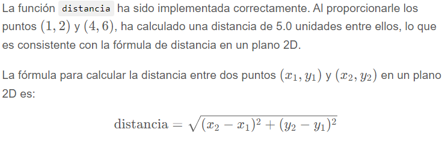

### Ejercicio 4
Implemente una función que calcule la distancia entre 2 puntos (2D). Utilice la función sqrt del paquete math para implementarla y compruebe el correcto funcionamiento de la misma.

```python
import math

def distancia(punto1, punto2):
    """
    Esta función calcula la distancia entre dos puntos en un plano 2D.
    """
    dx = punto2[0] - punto1[0]
    dy = punto2[1] - punto1[1]
    return math.sqrt(dx**2 + dy**2)

# Prueba
punto_a = (1, 2)
punto_b = (4, 6)
distancia_calculada = distancia(punto_a, punto_b)

distancia_calculada
```
>5.0




### Ejercicio 5
Investigue y escriba código que demuestre el funcionamiento de los “slices” en listas

Los "slices" en Python son una herramienta que permite extraer subconjuntos de listas (y otros tipos de secuencias, como strings y tuplas). Los slices se definen con la notación `lista[inicio:final:pasos]`.

Aquí hay una explicación básica de cómo funcionan los slices:

1. **Inicio**: Es el índice desde donde comienza el slice. Si se omite, se asume que es el inicio de la lista.
2. **Final**: Es el índice donde termina el slice (sin incluirlo). Si se omite, se asume que es el final de la lista.
3. **Pasos**: Es la cantidad de índices que se saltará al tomar elementos. Si se omite, se asume que es 1.

Vamos a demostrar el funcionamiento de los slices con ejemplos:

```python
# Definimos una lista de muestra
lista = [0, 1, 2, 3, 4, 5, 6, 7, 8, 9]

# Ejemplos de slices

# Tomar todos los elementos desde el índice 2 hasta el índice 5 (sin incluir el 5)
ejemplo1 = lista[2:5]

# Tomar todos los elementos desde el inicio hasta el índice 4 (sin incluir el 4)
ejemplo2 = lista[:4]

# Tomar todos los elementos desde el índice 3 hasta el final
ejemplo3 = lista[3:]

# Tomar todos los elementos desde el índice 1 hasta el índice 8, pero saltando de 2 en 2
ejemplo4 = lista[1:8:2]

# Invertir la lista usando slices
ejemplo5 = lista[::-1]

ejemplo1, ejemplo2, ejemplo3, ejemplo4, ejemplo5
```


# Biblioteca Numpy

## Ejercicio 1
Practique la creación de vectores, matrices y tensores y responda:

¿Qué diferencias hay entre los constructores, array, empty, full, zeros, ones, identity?

¿Qué tipos de datos pueden utilizarse? ¿En qué se diferencian? ¿Cuál es el tipo que se toma por defecto?¿Es siempre el mismo?

¿Qué funciones se pueden utilizar para generar arreglos con números aleatorios?


### Ejercicio 2
Investigue y ejemplifique las funciones relacionadas al tamaño de los arrays de Numpy:
- ¿Para qué sirven las funciones shape, len, ndim, size?
- ¿Qué tipos de datos pueden utilizarse? ¿En qué se diferencian? ¿Cuál es el tipo que se toma por defecto?¿Es siempre el mismo?
- ¿Qué funciones se pueden utilizar para generar arreglos con números aleatorios?


### Ejercicio 3
Practique funciones de agregación (sum, min, max, etc.) sobre vectores, matrices y tensores. Enumere y pruebe todas las funciones que encuentre y responda:
- ¿Estas funciones se aplican a todos los datos del array o pueden realizarse sobre dimensiones particulares? Ejemplifique.


### Ejercicio 4
Investigue y realice ejemplos que utilicen funciones para manipular elementos de arreglos (append, insert, delete, etc.) y arreglos entre sí (vstack, hstack, contacenate, etc.)


### Ejercicio 5
Los arrays de numpy (así como las listas) proveen de un mecanismo versátil para hacer o referenciar una sección de los mismos. Practique este mecanismo de acceso con vectores, matrices y tensores imprimiendo y modificando distintas regiones de los mismos


# Biblioteca Pandas

### Ejercicio 1
Investigue el funcionamiento del Dataframe de Pandas y cree uno con la información de la siguiente tabla:

| Nombre | Edad | País      |
|--------|------|-----------|
| Juan   | 20   | Argentina |
| María  | 26   | Peru      |
| Pedro  | 18   | Brasil    |
| José   | 22   | Chile     |


Realice las siguientes operaciones:
- Imprimir los nombres de las columnas.
- Agregar a la tabla a Pablo que tiene 30 años y es originario de Colombia. Agregarlo de 2 formas diferentes.
- Eliminar de la tabla al Pedro repetido.
- Modificar los atributos de países que dicen “Peru” (sin acento) y reemplazarlos por “Perú” (con acento).

### Ejercicio 2
Guarde en disco el dataframe del ejercicio anterior en los siguientes formatos:
- archivo con separación por delimitadores (tabulador como separador).
- archivo con separación por delimitadores (punto y coma como separador).
- archivo excel.
- archivo json.